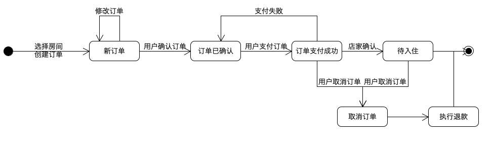

# Homework 9

使用类图，分别对 [Asg_RH](https://sysu-swsad.github.io/swad-guide/material/Asg_RH.pdf) 文档中 Make Reservation 用例以及 Payment 用例开展领域建模。然后，根据上述模型，给出建议的数据表以及主要字段，特别是主键和外键

### 1、Make Reservation 领域图

### 2、Payment 领域图

Hotel (ID/PrimeryKey, LocationID/ForeignKey, Name, Address, Star)

Room (ID/PrimeryKey, Type, Price, IsAvailable)

Travelers (ID/PrimeryKey, Name, Email)

Reservation (ID/PrimeryKey, TravelerID/ForeignKey, HotelID/ForeignKey, Date, Time, CheckInDate, CheckOutDate, AdultNum, ChildNum, ChildAge)

Payment (ID/PrimeryKey, ReservationID/ForeignKey, Date, Time, Total)

CreditCard (ID/PrimeryKey, TravelerID/ForeignKey, PaymentID/ForeignKey, Number, SecurityCode, ExpiryDate)

### 3、使用 UML State Model，对每个订单对象生命周期建模

- 建模对象： 参考 Asg_RH 文档， 对 Reservation/Order 对象建模。
- 建模要求： 参考练习不能提供足够信息帮助你对订单对象建模，请参考现在 定旅馆 的旅游网站，尽可能分析围绕订单发生的各种情况，直到订单通过销售事件（柜台销售）结束订单。

