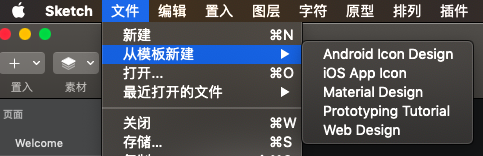
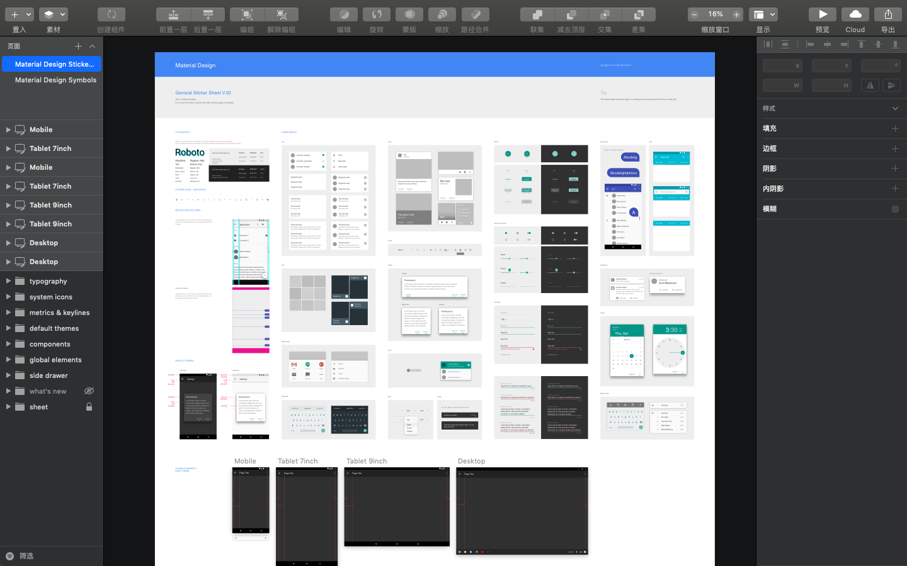
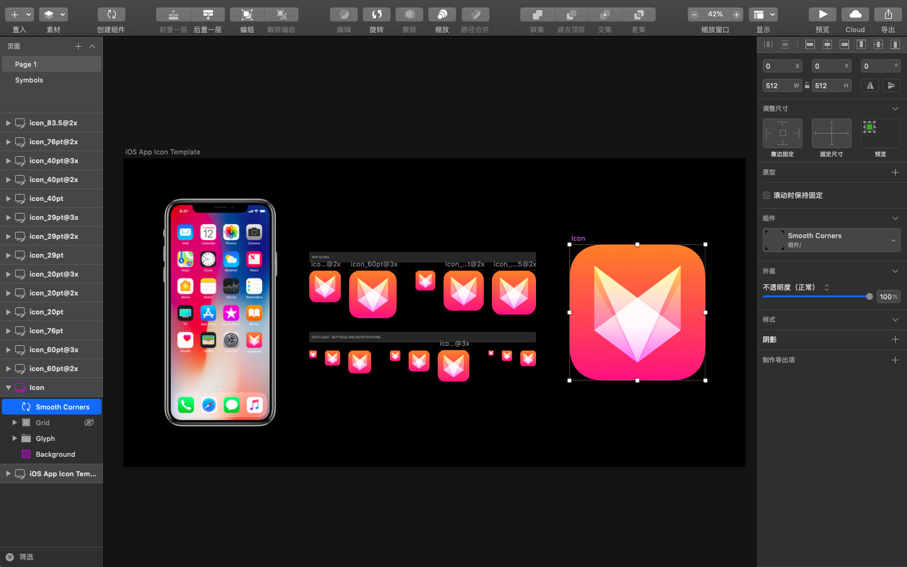
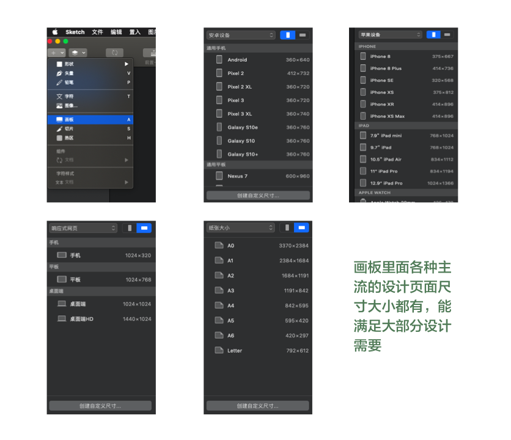
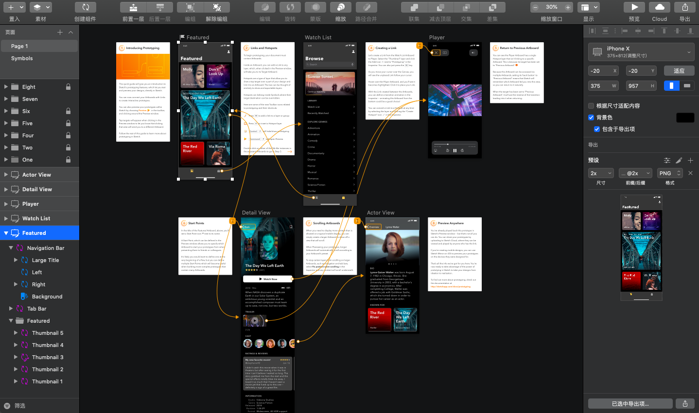
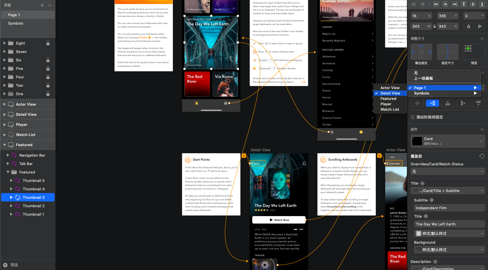
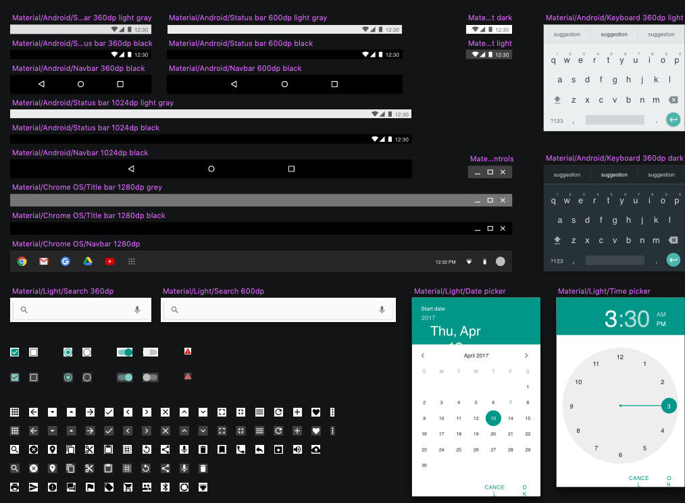
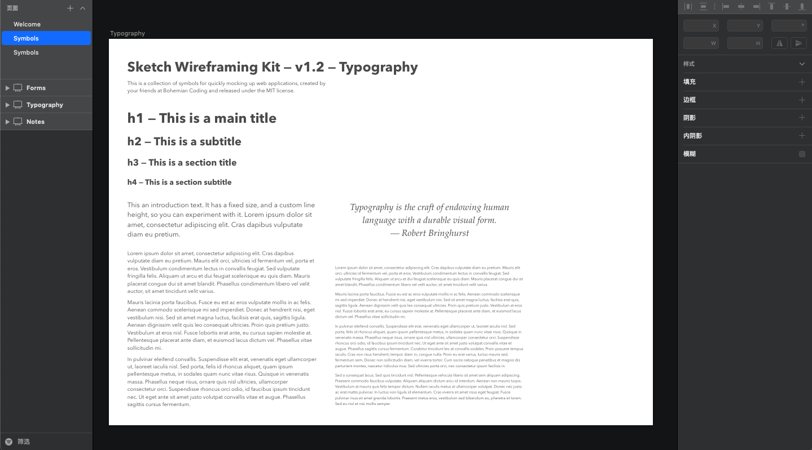
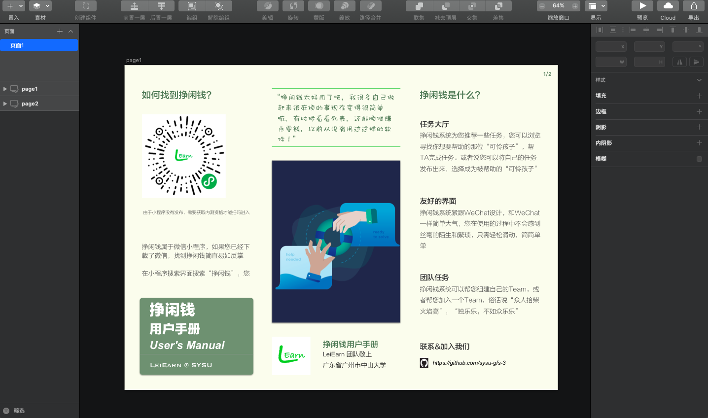

# 利用Skethch进行交互设计

说到产品原型制作的工具，大部分进行原型设计的人员都会选择**Axure**，它是眼下最受关注的原型开发工具，其能通过组件的方式帮助站点或软件设计师告诉建立带有凝视的原型（流程图、线框图），并凭借自己定义可重用的元件、动态面板以及丰富的script可以建立基本功能或页面逻辑的动态演示文件。

而**Sketch**是一款适用于所有设计师的矢量绘图应用。矢量绘图也是目前进行网页，图表以及界面设计的最好方式，除此之外它也可以用于制作精致的交互原型，虽然相对于像**Axure**这类原型设计工具来讲会有不足，但也不乏亮点之处。**Sketch**这款应用目前仅支持在 *Mac* 上使用。下面我会具体介绍一些本次课程项目过程中学习使用**Sketch**进行设计时的收获。

## Sketch模板

**Sketch**里面比较友好的一点是，它自带一些模板，而且用这些模板里的内容来做交互完全够用，省去从网上查找资源的麻烦。

打开*Android* 的模版后，可以看到关于 *Android* 设计的详细内容，包括页面布局，状态栏、导航栏、弹窗等等，这些内容也都被打包成控件的形式，当我们需要的时候，可以将整个控件直接拿过来使用，不仅省时而且非常精致，并且如果我们多去研究并拆解一下官方的这些控件的制作过程，能给我们提供很多设计思路，比如如何用各种形状拼合成想要的图形，如何利用填充和阴影达到想要的视觉效果。

## 原型设计

### 页面选择

原型的设计我们首先根据产品选择一个合适的界面载体，在工具的“置入”中选择“画板”，**Sketch**软件提供一些常用设备的尺寸供我们选择，我们根据产品的需要，进行具体的选择

### 内容的设置

之后就是根据自己的设计进行页面内容的布置，填充相关元素，下图是模板中的内容，最左侧的状态栏包含了页面Page 1 包含的具体内容，进行点击具体查看，除了有自定义形状、铅笔、矢量、图像字符等这些，也可以直接将你下载或者打包好的控件拖到这个页面进行使用。但是单纯的将交互样式罗列在页面上并不适用作为交付物，题哦功能给开发和测试同学进行使用，原因是标注信息无法直观的体现，以及功能点结构化的展示比较欠缺。比较好的解决方式就是下图中模板给出的方式，在具体界面旁边进行功能说明，并用很有对比的设计方式将这个页面的内容展示出来，从而帮助他人能快速知道下面的交互针对哪些具体功能。

查看最左侧状态栏那个控件下的具体内容，不难发现我们可以对画板中相关的元素根据相关性进行灵活的编组，比如页面内容的说明以“**One、Two、Three**”这种格式编组，具体的页面再单独编组，页面里不同的块还可以再编组。

页面的跳转我们可以通过右侧的工具栏，设置原型路径，实现箭头的指示

### 控件的设计

控件的内容主要包括组件和文本样式两部分

#### 组件

上边提到过，sketch自带模板中包含了很多常用控件，我们可以直接在自带的模板基础上进行设计，也可以自己创建一个新文件作为模板，然后根据情况，将需要使用到的控件复制过来用。我个人倾向于后一种，因为很多时候不需要这么多，按需提取即可，另外除了直接采用自带控件，自己也可以创建，同时可以灵活的维护多套模板，使用在不同的项目中。

无法采用哪种使用形式，控件的使用中都会涉及到了一个非常重要的**Sketch**功能点，那就是“组件/Symbol”，**Sketch**自带模板中的控件实际上就是组件的形式，它能够帮助我们方便的在多个页面和画板中重复运用某组内容。

除了系统层面的“状态栏”、“导航栏”、“键盘”等组件，针对特定的项目，自己也可以将常用的某个模块创建为组件，比如电商项目中常用的商品模板，可以创建“商品/横排”“商品/竖排”两种形式的组件，从而可以不断的快速复用。

#### 文本样式

“组件”功能的核心使用场景就是某些元素经常需要复用在不同地方，字体和图层也如此。在一个项目的交互稿中，使用到的样式种类是有限的，如果对每个元素如果都单独维护，会比较繁琐，sketch中的“文本样式”和“图层样式”功能就完美解决了这个问题，针对文字和图形元素，在“检查器”中选择需要共享的样式，能够快速的将颜色、阴影、不透明度等样式配置套用过来，而不再需要做重复性的样式配置，非常的便捷。

可以根据需要，整理一套自己常用的样式规范，比如”正文常规性文字”，统一采用“微软雅黑，色值#ffffff，字号18pt”的样式，在之前提到的“页面注释说明”，统一采用“微软雅黑，色值#5CD600，字号20pt”…….将规范维护成共享的样式文本，在需要的地方直接复用即可，不仅仅提高了效率，并且保证了交互稿统一美观性。

熟练使用“组件”和“文本样式”，不仅仅是在创建的时候能提高效率，尤其是在涉及修改时，你会发现只要修改一处，全局同步调整完成，那种快速带来的痛快感更加明显。当然效率的提升是一方面，通过不断复用标准精致的控件，采用统一规范的文本样式，也保障了交互稿整体的美观性。

## 其他类型的设计稿

**Sketch** 说到底还是一款绘图工具，作为绘图工具，图标、海报、画册的设计都不在话下。

